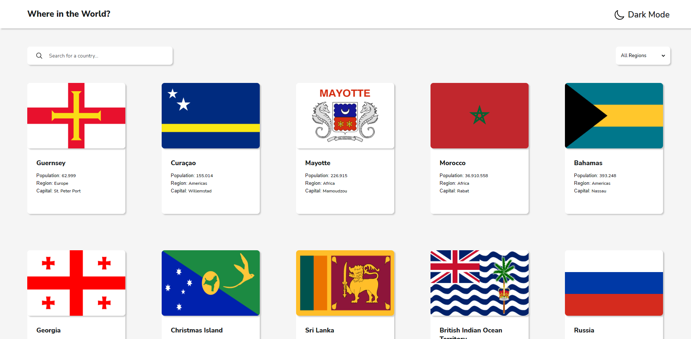
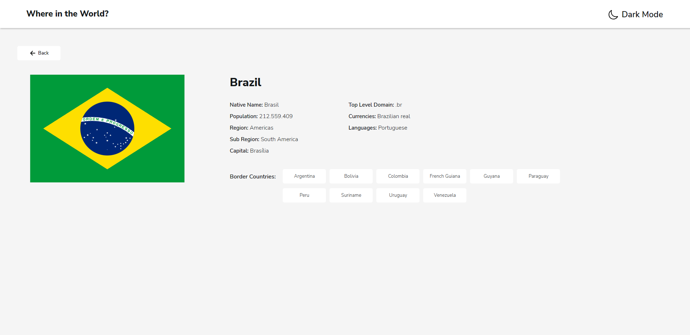
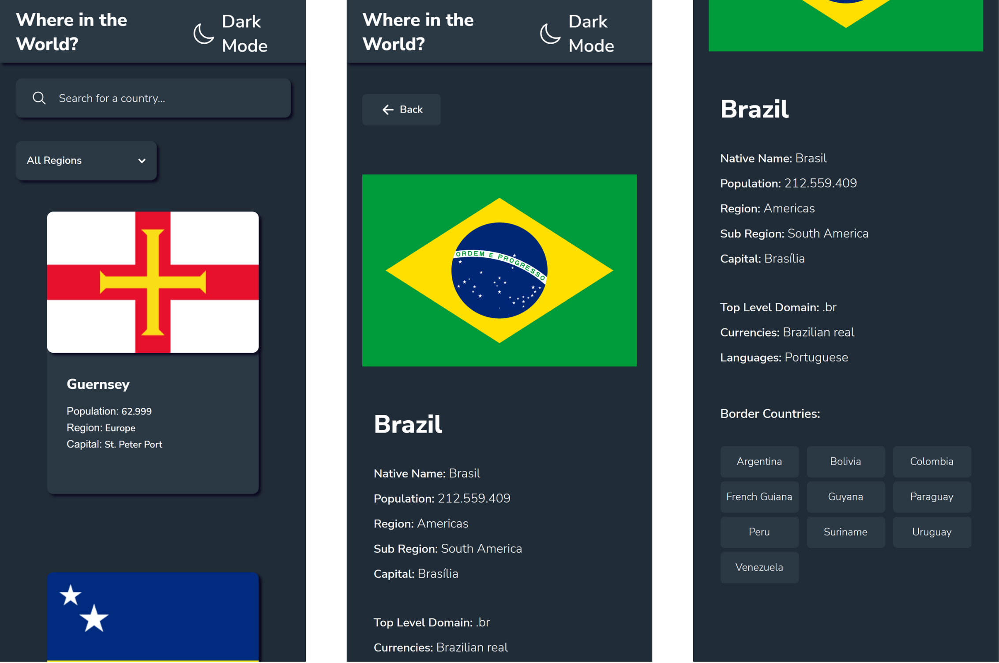

<h1 align="center"> Country API </h1>

  <a href="#-tecnologias">Tecnologias</a>&nbsp;&nbsp;&nbsp;|&nbsp;&nbsp;&nbsp;
  <a href="#-projeto">Projeto</a>&nbsp;&nbsp;&nbsp;|&nbsp;&nbsp;&nbsp;
  <a href="#-curiosidades">Curiosidades</a>&nbsp;&nbsp;&nbsp;|&nbsp;&nbsp;&nbsp;
  <a href="#memo-licença">Licença</a>

  

 

    <strong>Versão Desktop</strong>
  
    
  

 

    <strong>Versão Mobile</strong>
  

 

## 💻 Projeto

CountryAPI é um app com informações de países/regiões do mundo inteiro! 🌎

- [Visite o projeto online] (https://marcelosiqueira-countryapi.netlify.app/)

 

## 🚀 Tecnologias

Esse projeto foi desenvolvido com as seguintes tecnologias:

- Typescript 
- ReactJs
- RESTful API
- CSS3
- Git e Github

 

## 🔖 Curiosidades

* 🌑 O app possui modo escuro com detecção automática caso essa já seja a sua preferência em seu navegador.

* 📱 Layout totalmente responsivo e funcional para versão desktop e mobile.

* 🚀 Desenvolvido em ReactJs possibilitando uma aplicação de alto desempenho.

## :memo: Licença

Esse projeto está sob a licença MIT.

---

Feito com ♥ by Marcelo Siqueira